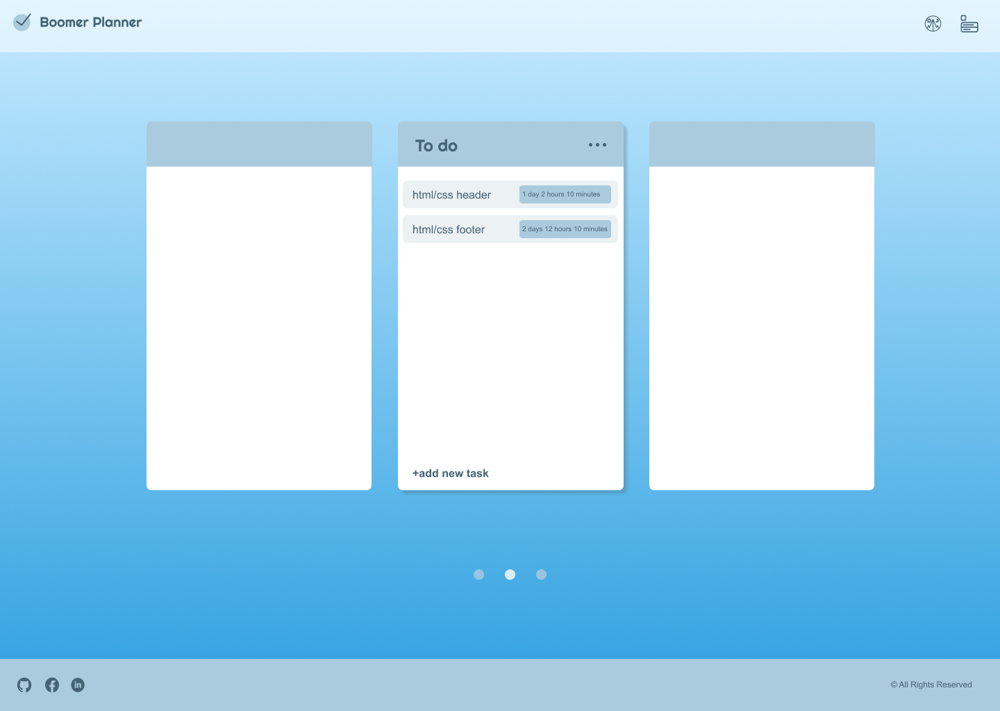

# Boomer Planner
To develop a project management tool that enables users to track the progress of each requirement of their applications.

## Teams

[NataliiaTasha](https://github.com/NataliiaTasha)
[javadaller](https://github.com/javadaller)
[ludoviclacroix82](https://github.com/ludoviclacroix82)

## Instructions

The link to the instructions is available [here](https://github.com/becodeorg/CRL-KELLER-7/tree/main/2.PROJECTS/4.To-do-list).

## Instructions

The link to the instructions is available [here](https://github.com/becodeorg/CRL-KELLER-7/tree/main/2.PROJECTS/5.Project-Planner).

## Languages Used
- Semantic HTML, SCSS
- Responsive design
- JavaScript
- The DOM
- Event listeners
- localStorage

## links

- You can access the project on GitHub Pages [here](https://ludoviclacroix82.github.io/Project-Planner/).
- You can access the Figma on the project [here](https://www.figma.com/design/jYs1kcGV292y2q2agbHTQa/BeCode-Planner?node-id=0-1&t=wVLyPGfl2dWyIU73-0) realised by [NataliiaTasha](https://github.com/NataliiaTasha)

## Project Screenshot

### Issue with Drag & Drop on Mobile Devices
We have identified an issue with the drag & drop functionality on mobile devices. Currently, this feature does not work properly on mobile devices, which may limit the user experience for mobile users.